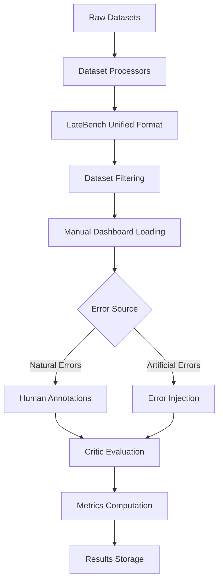

# LateBench: Mathematical Reasoning Error Analysis Framework

**LateBench** is a research project for analyzing and evaluating reasoning errors in math problems. The project focuses on **late-occurring errors**—subtle mistakes that appear deep within mathematical reasoning chains, making them particularly challenging to detect.

## 🎯 Project Vision & Objectives

LateBench addresses critical gaps in mathematical reasoning evaluation by creating a standardized framework that combines:

### **Core Research Goals**
1. **Systematic Error Analysis**: Study late error performance on late appearing errors, both naturally occurring and artificially injected.
2. **Data curation**: Create a dataset of erroneous solutions with careful mistake injection.
3. **Multi-Dataset Unification**: Combine problems across diverse mathematical reasoning datasets
4. **Critic Quality Assessment**: Analyze current critic capabilities on the created benchmark
5. **Research Infrastructure**: Create a dashboard for convenient visualization that allows simple experiments with error injection.

## 🏗️ Complete Project Architecture & Data Flow

### **Full Data Processing Pipeline**



### **Detailed Data Flow Documentation**

#### **Phase 1: Raw Data Loading → Processing**

**1.1 Dataset Sources**
- **PRM800K**: Human-annotated step-level mathematical reasoning with ratings (-1, 0, +1)
- **NuminaMath**: Large-scale competition mathematics with step-by-step solutions
- **ProcessBench**: Mathematics Olympiad problems with expert annotations

**1.2 Processing to LateBench Format**
```python
# Each processor converts raw data to unified LateBenchExample format
prm800k_processor = PRM800KProcessor()
examples = prm800k_processor.process_dataset(
    input_file="data/prm800k/phase2_train.jsonl",
    output_file="data/datasets/latebench_prm800k_complete_v2.json"
)
```

**Key Processing Features:**
- **Unified Schema**: All datasets converted to `LateBenchExample` objects with consistent fields
- **Explicit Error Location**: `original_error_steps` and `injected_error_steps` fields for clean ground truth
- **Human Annotation Preservation**: Maintains step-level ratings and importance from human annotators
- **Metadata Conservation**: Preserves source dataset characteristics while enabling cross-dataset analysis

#### **Phase 2: LateBench Format → Filtering**

**2.1 Dataset Filtering by solution length**
```bash
# Automatic filtering based on step count and error presence
python3 -c "
# Correct examples: ≥20 steps, no original errors
# Error examples: ≥10 steps, has human-identified errors
correct_examples = filter(lambda ex: len(ex.solution.steps) >= 20 and not ex.original_error_steps)
error_examples = filter(lambda ex: len(ex.solution.steps) >= 10 and ex.original_error_steps)
"
```

**Current Filtered Dataset Statistics:**
- **PRM800K Correct**: 1,579 examples (≥20 steps, no errors)
- **PRM800K Error**: 16,100 examples (≥10 steps, finishes with human-identified errors)

#### **Phase 3: Manual Dashboard Loading**

**3.1 Interactive Research Dashboard**
```bash
python3 dashboard/minimal_app.py
# Access at http://localhost:8080
```

**Dashboard Features:**
- **Dataset Selection**: Load different subsets (correct vs error examples)
- **Problem Navigation**: Browse through examples with step-by-step visualization
- **Real-time Processing**: Manual error injection and critic evaluation
- **Decision Workflow**: Yes/Maybe/No curation for quality control

#### **Phase 4: Error Source Handling**

**4.1 Natural Errors (from Human Annotations)**
- **Ground Truth Source**: `original_error_steps` field populated from human ratings
- **PRM800K Example**: Human annotators identified specific steps with -1 ratings as errors

**4.2 Artificial Errors (Error Injection)**
```python
injector = ErrorInjector(model="gpt-4-turbo-preview")
result_example = injector.inject_error(example)
# Populates injected_error_steps field with artificial error locations
```

**Error Injection Features:**
- **GPT-4 Powered**: Sophisticated natural-looking error introduction
- **Late Error Targeting**: Focus on errors in final third of solution steps
- **Custom Suggestions**: Manual error specification through dashboard
- **Explicit Tracking**: `injected_error_steps` field records exact error locations

#### **Phase 5: Critic Evaluation**

**5.1 Batch Critic Processing**
```bash
python3 scripts/run_batch_processing.py \
  --input-file data/datasets/latebench_prm800k_error_v2.json \
  --output-file results/experiments/prm800k_critic_results_100.json \
  --run-critic --critic-mode original --max-examples 100
```

**Critic Features:**
- **Independent Assessment**: GPT-4o-mini powered mathematical reasoning validation
- **Step-Level Analysis**: Granular error detection with detailed explanations
- **Batch Processing**: Parallel evaluation with intelligent rate limiting
- **Embedded Predictions**: Results stored directly in `critic_predictions_original/injected` fields

#### **Phase 6: Metrics Computation**

**6.1 Clean Metrics Evaluation**
```python
from core.metrics import evaluate_critic_on_dataset, print_metrics_summary

# Direct evaluation using explicit error fields - no fallback logic
metrics = evaluate_critic_on_dataset(
    examples_with_predictions, 
    evaluation_mode="original",  # Uses original_error_steps as ground truth
    use_first_error_cutoff=True
)
print_metrics_summary(metrics)
```

**Ground Truth Extraction (No Fallback Logic):**
```python
def get_ground_truth_error_steps(example: LateBenchExample, evaluation_mode: str) -> List[int]:
    if evaluation_mode == "original":
        return example.original_error_steps  # Direct field access
    elif evaluation_mode == "injected":
        return example.injected_error_steps  # Direct field access
    else:  # auto mode
        return example.injected_error_steps if example.injected_error_steps else example.original_error_steps
```

#### **Phase 7: Results Storage**

**7.1 Organized Results Structure**
```
results/
├── experiments/          # Raw experimental data and critic predictions
│   ├── prm800k_critic_results_100.json
│   └── [other experiment results]
├── evaluations/         # Processed evaluation metrics and analysis
│   ├── prm800k_metrics_analysis.json
│   └── [other metric analyses]
├── metrics/            # Standalone metric computations
└── README.md          # Results documentation
```

**7.2 Clean Evaluation Pipeline**
```bash
# Run experiment
python3 scripts/run_batch_processing.py [options] --output-file results/experiments/experiment_name.json

# Compute metrics
python3 scripts/run_evaluation.py results/experiments/experiment_name.json --output-name analysis_name
```

## 🗂️ **Current Project Structure**

```
latebench/
├── src/                                    # Core framework
│   ├── data_processing/                    # Dataset processors & unified schema
│   │   ├── unified_schema.py               # LateBenchExample with explicit error fields
│   │   │   ├── LateBenchExample            # Main data structure
│   │   │   ├── original_error_steps        # Ground truth from human annotations
│   │   │   ├── injected_error_steps        # Ground truth from error injection
│   │   │   └── [critic_predictions fields] # Embedded critic results
│   │   ├── prm800k_processor.py            # PRM800K human annotation processing
│   │   ├── numinamath_processor.py         # Competition mathematics processing
│   │   └── processbench_processor.py       # ProcessBench processing
│   ├── core/                               # Core processing systems
│   │   ├── data_loader.py                  # Unified dataset loading
│   │   ├── error_injector.py               # GPT-4 powered error injection
│   │   ├── critic.py                       # LLM critic evaluation with batch processing
│   │   └── metrics.py                      # Clean metrics using explicit error fields
│   └── utils/                              # Utilities
│       └── storage.py                      # Data storage and loading utilities
├── dashboard/                              # Interactive web interface
│   ├── minimal_app.py                      # Flask application with full research workflow
│   ├── templates/minimal_dashboard.html    # Dashboard interface with error visualization
│   └── data/                               # Dashboard-specific data storage
├── scripts/                                # Clean processing scripts
│   ├── run_batch_processing.py             # Unified batch processing (injection + critic)
│   ├── run_evaluation.py                   # Clean metrics computation script
│   ├── create_numinamath_subsample.py      # Dataset sampling utilities
│   └── download_numinamath.py              # Dataset acquisition
├── data/                                   # Data organization
│   ├── datasets/                           # Processed LateBench format datasets
│   │   ├── latebench_prm800k_correct_v2.json      # 1,579 examples (≥20 steps, no errors)
│   │   ├── latebench_prm800k_error_v2.json        # 16,100 examples (≥10 steps, has errors)
│   │   ├── latebench_numinamath_complete.json     # NuminaMath competition problems
│   │   └── latebench_processbench_*.json          # ProcessBench datasets
│   └── prm800k/                            # Raw PRM800K data
│       └── phase2_train.jsonl              # Original PRM800K with human annotations
├── results/                                # Organized results storage
│   ├── experiments/                        # Raw experimental data
│   ├── evaluations/                        # Processed metrics and analysis
│   ├── metrics/                            # Standalone metric computations
│   └── README.md                           # Results documentation
├── requirements.txt                        # Python dependencies
└── README.md                              # This comprehensive documentation
```

## 📊 **Current Dataset Statistics & Performance**

### **Processed Datasets**
| Dataset | Total | Correct | Error | Format | Status |
|---------|-------|---------|-------|---------|--------|
| **PRM800K** | 97,782 | 1,579 (≥20 steps) | 16,100 (≥10 steps) | Human annotations | ✅ Production |
| **NuminaMath** | 859,594 | 859,594 | - | Competition problems | ✅ Production |
| **ProcessBench** | 147 | 51 | 96 | Process supervision | ✅ Production |

### **Critic Performance Results** (100 PRM800K Error Examples)

| Metric | Value | Description |
|--------|--------|-------------|
| **Error Detection Accuracy** | 99.0% | Correctly identified that errors exist |
| **First Error Accuracy** | 92.0% | Found the actual human-identified error step |
| **Step-level F1 Score** | 0.357 | Balanced precision/recall for specific error steps |
| **False Positive Rate** | 24.7% | Rate of incorrectly flagged non-error steps |
| **Early Detection Rate** | 99.0% | Found errors at or before actual error position |

**Key Insights:**
- **Excellent Error Detection**: Critics are very good at detecting *that* errors exist
- **Good Error Localization**: Critics find the actual error step 92% of the time
- **Over-Prediction Issue**: Critics predict 4.24 error steps per problem vs 1.0 actual
- **Position Bias**: Critics predict errors earlier (avg 9.8) than they occur (avg 14.1)

## 🛠️ Installation & Quick Start

### Prerequisites
- Python 3.8+
- OpenAI API key (for error injection and critic evaluation)
- 2GB+ free disk space (for datasets)

### Installation

```bash
# 1. Clone repository
git clone https://github.com/your-username/latebench.git
cd latebench

# 2. Setup environment
python -m venv .venv
source .venv/bin/activate  # Windows: .venv\Scripts\activate
pip install -r requirements.txt

# 3. Configure OpenAI API
export OPENAI_API_KEY="your-api-key-here"

# 4. Verify installation
python3 -c "from src.data_processing.unified_schema import LateBenchExample; print('✅ Installation successful')"
```

### Launch Dashboard

```bash
python3 dashboard/minimal_app.py
# Access at http://localhost:8080
```

## 🔬 Complete Research Workflows

### **1. Dataset Processing Pipeline**

```bash
# Process raw PRM800K data to LateBench format
python3 -c "
import sys
sys.path.insert(0, 'src')
from data_processing.prm800k_processor import PRM800KProcessor

processor = PRM800KProcessor()
processor.process_dataset(
    'data/prm800k/phase2_train.jsonl',
    'data/datasets/latebench_prm800k_complete_v2.json'
)
"

# Filter and split by complexity
python3 -c "
# Automatic filtering creates correct_v2.json and error_v2.json
# with step count thresholds and error presence checks
"
```

### **2. Batch Critic Evaluation**

```bash
# Run critic on 100 error examples
python3 scripts/run_batch_processing.py \
  --input-file data/datasets/latebench_prm800k_error_v2.json \
  --output-file results/experiments/prm800k_critic_100.json \
  --run-critic \
  --critic-mode original \
  --max-examples 100 \
  --batch-size 25 \
  --critic-workers 4
```

### **3. Clean Metrics Computation**

```bash
# Compute metrics using explicit error fields (no fallback logic)
python3 scripts/run_evaluation.py \
  results/experiments/prm800k_critic_100.json \
  --output-name prm800k_100_analysis
```

### **4. Interactive Dashboard Research**

```python
# Launch dashboard for manual curation
python3 dashboard/minimal_app.py

# Dashboard features:
# - Navigate through examples with error visualization
# - Run real-time error injection
# - Evaluate with critic
# - Make Yes/Maybe/No research decisions
# - Export curated datasets
```

## 🧪 Key Framework Features

### **Explicit Error Location System**
- **No Fallback Logic**: Direct field access to `original_error_steps` and `injected_error_steps`
- **Clean Ground Truth**: Human annotations stored explicitly, not inferred
- **Deterministic Metrics**: Evaluation results are completely reproducible

### **Unified Data Format**
- **LateBenchExample**: Consistent schema across all mathematical reasoning datasets
- **Embedded Predictions**: Critic results stored directly in example objects
- **Metadata Preservation**: Source dataset characteristics maintained

### **Production-Ready Pipeline**
- **Batch Processing**: Parallel error injection and critic evaluation
- **Organized Results**: Clean directory structure for experiments and analysis
- **Comprehensive Logging**: Full traceability of processing steps

## 🔮 Current Capabilities & Research Applications

### **Completed Research Infrastructure**
- ✅ **Multi-Dataset Unification**: PRM800K, NuminaMath, ProcessBench in unified format
- ✅ **Explicit Ground Truth**: Clean error location tracking without fallback logic
- ✅ **Batch Processing**: Scalable parallel processing for large-scale experiments
- ✅ **Interactive Dashboard**: Complete research workflow in web interface
- ✅ **Clean Metrics**: DeltaBench-compatible evaluation with explicit error fields
- ✅ **Results Organization**: Structured storage for experiments and analysis


## 📄 License & Citation

This project is licensed under the MIT License - see the [LICENSE](LICENSE) file for details.

### **Citation**
```bibtex
@software{latebench2024,
  title={LateBench: A Comprehensive Framework for Mathematical Reasoning Error Analysis},
  author={[Research Team]},
  year={2024},
  url={https://github.com/your-username/latebench},
  note={Framework for analyzing late-occurring errors in mathematical reasoning with explicit ground truth}
}
```

---

**LateBench** - *Advancing mathematical reasoning evaluation through systematic error analysis.* 🔢✨
